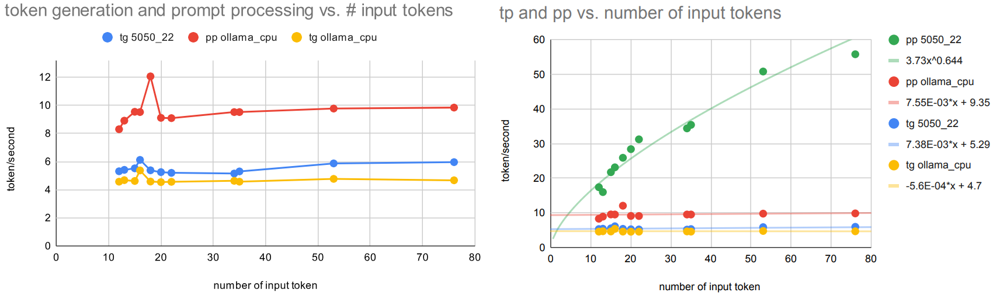
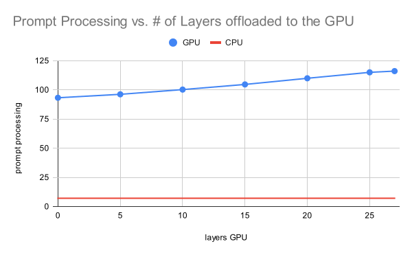
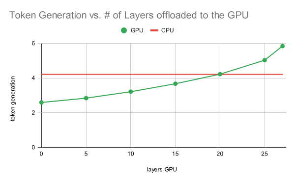
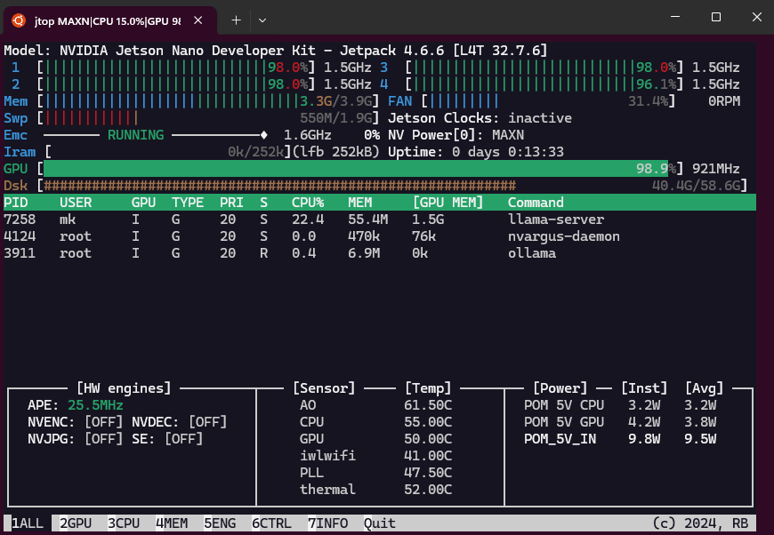

# Llama.cpp with CUDA support on a Jetson Nano

<a href="https://github.com/ggml-org/llama.cpp"></a>


[](https://github.com/kreier/llama.cpp-jetson/actions/workflows/pages/pages-build-deployment)

It is possible to compile a recent llama.cpp with GPU support, using `gcc 8.5` and `nvcc 10.2` (latest supported CUDA compiler from Nvidia for the 2019 Jetson Nano). The steps to compile a new version are described here. You can also install a compiled version with [this other repository](https://github.com/kreier/llama.cpp-jetson.nano) in a few minutes.

- [Prerequisites](#prerequisites)
- [Procedure](#procedure) - 5 minutes, plus 85 minutes for the compilation in the last step
- [Benchmark](#benchmark)
  - [B1: TinyLlama-1.1-Chat](#b1-tinyllama-11b-chat-2023-12-31)
  - [B2: Gemma3:1b](#b2-gemma31b-2025-03-12)
  - [Variance in PP (prompt processing) when using the GPU](#explaining-the-variance-in-prompt-processing-when-using-the-gpu)
  - [B3: Gemma3:4b](#b3-gemma34b)
  - [Running ollama and llama-server at the same time](#running-ollama-and-llama-server-at-the-same-time)
- [Compile llama.cpp for CPU mode](#compile-llamacpp-for-cpu-mode) - 24 minutes
- [Install build 5050](#install-build-5050) - 1 minute, first start needs extra 6:30 min (later 12 seconds)
- [Install prerequisites](#install-prerequisites)
  - [Install `cmake >= 3.14`](#install-cmake--314) - 38 minutes
- [Choosing the right compiler](#choosing-the-right-compiler)
  - [GCC 9.4](#gcc-94) - 4 minutes
  - [GCC 8.4](#gcc-84) - 24 seconds
  - [GCC 8.5](#gcc-85) - 3 hours
- [History](#history)
- [Sources](#sources)

The Jetson Nano indeed uses the GPU ([footnote 1](#footnotes)) to generate tokens with 100% GPU load, 1.5 GB GPU memory and 4 Watt power usage, while the CPU is only used in the 14% range with 0.6 Watt. It is on average **20% faster** than the pure CPU use with ollama or a CPU build - see the [benchmark](#benchmark) section below!


## Prerequisites

The following software packages need to be installed. The section "[Install prerequisites](#install-prerequisites)" describes the process in detail. The installation of `gcc 8.5` and `cmake 3.27` might take several hours.

- Nvidia CUDA Compiler nvcc 10.2 - `nvcc --version`
- GCC and CXX (g++) 8.5 - `gcc --version`
- cmake >= 3.14 - `cmake --version`
- `nano`, `curl`, `libcurl4-openssl-dev`, `python3-pip` and `jtop`

## Procedure

Newer versions of llama.cpp are constantly relased. We will check out a specific version (b5050 from April 2025) known to be working to ensure this repository keeps working in the future. If you want to try a more recent version remove the steps `git checkout 23106f9` and `git checkout -b llamaJetsonNanoCUDA` in the following instructions:

### 1. Clone repository

``` sh
git clone https://github.com/ggml-org/llama.cpp llama5050gpu.cpp
cd llama5050gpu.cpp
git checkout 23106f9
git checkout -b llamaJetsonNanoCUDA
```

For the next steps 2. to 5. we have to make changes to these 6 files:

- CMakeLists.txt 14
- ggml/CMakeLists.txt 274
- ggml/src/ggml-cuda/common.cuh 455
- ggml/src/ggml-cuda/fattn-common.cuh 623
- ggml/src/ggml-cuda/fattn-vec-f32.cuh 71
- ggml/src/ggml-cuda/fattn-vec-f16.cuh 73

In early 2025 llama.cpp started supporting and using `bfloat16`, a feature not included in nvcc 10.2. We have two options:

- Option A: Create two new files
    - /usr/local/cuda/include/cuda_bf16.h
    - /usr/local/cuda/include/cuda_bf16.hpp
- Option B: Edit 3 files
    - ggml/src/ggml-cuda/vendors/cuda.h
    - ggml/src/ggml-cuda/convert.cu
    - ggml/src/ggml-cuda/mmv.cu

Details for each option are described below in step 2 to 7:

### 2. Add a limit to the CUDA architecture in `CMakeLists.txt`

Edit the file *CMakeLists.txt* with `nano CMakeLists.txt`. Add the following 3 lines after line 14 (with **Ctrl+\_** you can jump to this line, check line with **Ctrl+c**):

```
if(NOT DEFINED ${CMAKE_CUDA_ARCHITECTURES})
    set(CMAKE_CUDA_ARCHITECTURES 50 61)
endif()
```

Save with **Ctrl+o** and exit with **Ctrl+x**.

### 3. Add two linker instructions after line 274 in `ggml/CMakeLists.txt`

Edit the file with `nano ggml/CMakeLists.txt` and enter two new lines after `set_target_properties(ggml PROPERTIES PUBLIC_HEADER "${GGML_PUBLIC_HEADERS}")` and before `#if (GGML_METAL)`. It should then look like:

``` h
set_target_properties(ggml PROPERTIES PUBLIC_HEADER "${GGML_PUBLIC_HEADERS}")
target_link_libraries(ggml PRIVATE stdc++fs)
add_link_options(-Wl,--copy-dt-needed-entries)
#if (GGML_METAL)
#    set_target_properties(ggml PROPERTIES RESOURCE "${CMAKE_CURRENT_SOURCE_DIR}/src/ggml-metal.metal")
#endif()
```

With `target_link_libraries(ggml PRIVATE stdc++fs)` and `add_link_options(-Wl,--copy-dt-needed-entries)` we avoid some static link issues that don't appear in later gcc versions. See [nocoffei's comment](https://nocoffei.com/?p=352).

### 4. Remove *constexpr* from line 455 in `ggml/src/ggml-cuda/common.cuh`

Use `nano ggml/src/ggml-cuda/common.cuh` to remove the **constexpr** after the *static* in line 455. This feature from CUDA C++ 17 we don't support anyway. After that it looks like:

``` h
// TODO: move to ggml-common.h
static __device__ int8_t kvalues_iq4nl[16] = {-127, -104, -83, -65, -49, -35, -22, -10, 1, 13, 25, 38, 53, 69, 89, 113};
```

### 5. Comment lines containing *__buildin_assume* by adding "//" in 3 files

Comment the lines by adding a // in front of these 3 files. This avoids the compiler error *"__builtin_assume" is undefined*.

- line 623, `nano ggml/src/ggml-cuda/fattn-common.cuh`
- line 71, `nano ggml/src/ggml-cuda/fattn-vec-f32.cuh`
- line 73, `nano ggml/src/ggml-cuda/fattn-vec-f16.cuh`

If you have a version lower than b4400 you can skip the next step.

In January 2025 with version larger than b4400 llama.cpp started including support for `bfloat16`. There is a standard library `cuda_bf16.h` in the folder `/usr/local/cuda/targets/aarch64-linux/include` for nvcc 11.0 and larger. It has more than 5000 lines. One cannot simply copy and paste a version from Cuda 11 to our folder for Cuda 10.2 and hope it would work. The same applies to its companion `cuda_bf16.hpp` with 3800 lines. Since it is linked to version 11 or 12, the error messages keep expanding (e.g. `/usr/local/cuda/include/cuda_bf16.h:4322:10: fatal error: nv/target: No such file or directory`). We have two working options:

### 6. Option A: Create a `cuda_bf16.h` that redefines `nv_bfloat16` as `half`

Create two new files in the folder `/usr/local/cuda/include/`, starting with `cuda_bf16.h`. You need root privileges, so execute `sudo nano /usr/local/cuda/include/cuda_bf16.h` and give it the following content:

``` h
#ifndef CUDA_BF16_H
#define CUDA_BF16_H

#include <cuda_fp16.h>

// Define nv_bfloat16 as half
typedef half nv_bfloat16;

#endif // CUDA_BF16_H
```

Create the second file `sudo nano /usr/local/cuda/include/cuda_bf16.hpp` with the content

``` hpp
#ifndef CUDA_BF16_HPP
#define CUDA_BF16_HPP

#include "cuda_bf16.h"

namespace cuda {

    class BFloat16 {
    public:
        nv_bfloat16 value;

        __host__ __device__ BFloat16() : value(0) {}
        __host__ __device__ BFloat16(float f) { value = __float2half(f); }
        __host__ __device__ operator float() const { return __half2float(value); }
    };

} // namespace cuda

#endif // CUDA_BF16_HPP
```

### 6. Option B: Comment all code related to *bfloat16* in 3 files

The second solution is to remove all references to the *bfloat16* data type in the 3 files referencing them. First we have to __NOT__ include the nonexisting `cuda_bf16.h`. Just add two // in front of line 6 with `nano ggml/src/ggml-cuda/vendors/cuda.h`. After that it looks like this:

``` h
#include <cuda.h>
#include <cublas_v2.h>
//#include <cuda_bf16.h>
#include <cuda_fp16.h>
```

That is not enough, the new data type `nv_bfloat16` is referenced 8 times in 2 files. Replace each instance of them with `half`

- 684 in `ggml/src/ggml-cuda/convert.cu`
- 60 in `ggml/src/ggml-cuda/mmv.cu`
- 67 in `ggml/src/ggml-cuda/mmv.cu`
- 68 in `ggml/src/ggml-cuda/mmv.cu`
- 235 in `ggml/src/ggml-cuda/mmv.cu` (2x)
- 282 in `ggml/src/ggml-cuda/mmv.cu` (2x)

**DONE!** Only two more instructions left.


### 7. Execute `cmake -B build` with more flags to avoid the CUDA17 errors

We need to add a few extra flags to the recommended first instruction `cmake -B build`. If not done several errors like *Target "ggml-cuda" requires the language dialect "CUDA17" (with compiler extensions)* would stop the compilation. We still have a few warnings *constexpr if statements are a C++17 feature*, but we can ignore them.

``` sh
cmake -B build -DGGML_CUDA=ON -DLLAMA_CURL=ON -DCMAKE_CUDA_STANDARD=14 -DCMAKE_CUDA_STANDARD_REQUIRED=true -DGGML_CPU_ARM_ARCH=armv8-a -DGGML_NATIVE=off
```

And 15 seconds later we're ready for the last step, the instruction that will take **85 minutes** (faster SD card: 60 minutes) to have llama.cpp compiled:

``` sh
cmake --build build --config Release
```

Successfully compiled! 


After that you can start a conversation with Gemma3 about finer details of our universe:

``` sh
./build/bin/llama-cli -hf ggml-org/gemma-3-1b-it-GGUF -p "Explain quantum entanglement" --n-gpu-layers 99
```


The answers vary, sometimes it throws in a video from Veritasium. And it could easily *"Write a 1000 word essay about the French Revolution"* with $pp = 21 \frac{token}{s}$ and $tg = 5.13 \frac{token}{s}$. Impressive! 


## Benchmark

We use the same Jetson Nano machine from 2019, no overclocking settings. The test prompt for `llama-cli`, `ollama` and the older `main` is "Explain quantum entanglement". Tests include the latest ollama 0.6.4 from April 2025 in CPU mode and several versions of llama.cpp compiled in pure CPU mode and with GPU support, using different amounts of layers offloaded to the GPU. The three LLM models considerd in the benchmarks are:

- 2023-12-31 **B1:** [TinyLlama-1.1B-Chat Q4 K M](https://huggingface.co/TheBloke/TinyLlama-1.1B-Chat-v1.0-GGUF?show_file_info=tinyllama-1.1b-chat-v1.0.Q4_K_M.gguf) with 669 MB, 22 layers, 1.1 billion parameters and 2048 context length
- 2025-03-12 **B2:** [Gemma3:1b Q4 K M](https://huggingface.co/ggml-org/gemma-3-1b-it-GGUF?local-app=llama.cpp) with 806 MB, 27 layers, 1 billion parameters and 32768 context length
- 2025-04-03 **B3:** [Gemma3:4b_it_qat_q4_0](https://huggingface.co/google/gemma-3-4b-it-qat-q4_0-gguf) with 3.16 GB, 35 layers, 3.88 billion parameters, image-to-text support (normalized 896x896)  and 128000 total input context

### B1: TinyLlama-1.1B-Chat 2023-12-31

The first prompt is for older builds b1618 and b2275 that use `main`, while b4400 and b5050 use the second `llama-cli` call. Put the prompt in the cli after the startup.

``` sh
./main -hf TheBloke/TinyLlama-1.1B-Chat-v1.0-GGUF --n-gpu-layers 25 -p "Explain quantum entanglement"
./build/bin/llama-cli -hf TheBloke/TinyLlama-1.1B-Chat-v1.0-GGUF --n-gpu-layers 25
llama-cli -hf kreier/tiny
```

llama.cpp has also a build-in benchmark program alled `llama-bench`, here tested with the CUDA version b5043:

``` sh
m@n:~/./build/bin/llama-bench -m ../.cache/llama.cpp/TheBloke_TinyLlama-1.1B-Chat-v1.0.Q2_K.gguf --n-gpu-layers 99
ggml_cuda_init: found 1 CUDA devices:
  Device 0: NVIDIA Tegra X1, compute capability 5.3, VMM: no
| model                  |       size | params | backend | ngl |  test |          t/s |
| ---------------------- | ---------: | -----: | ------- | --: | ----: | -----------: |
| llama 1B Q4_K - Medium | 636.18 MiB | 1.10 B | CUDA    |  99 | pp512 | 80.57 ± 0.33 |
| llama 1B Q4_K - Medium | 636.18 MiB | 1.10 B | CUDA    |  99 | tg128 |  6.69 ± 0.00 |

build: c262bedd (5043)
```

The prompt processing speed seems to be too high in this benchmark (found the answer a few days later, see [explanation later in this document](#explaining-the-variance-in-prompt-processing-when-using-the-gpu)) for the small models run on the Jetson Nano. To have a more realistic comparison for the graph below the `llama-cli` was used to determine both the pp and tg metrics. Similar results were achieved with longer prompts like "Write a 1000 word essay about the French Revolution".


**Explanation**: Earlier editions of llama.cpp like b1618 from December 2023 or b4400 from December 2024 got faster in all their metrics with improvements to their code. The native speed of a CPU compile from April 2025 (b5036) has the same speed (within error) as a CPU build from ollama 0.6.4 from the same time for both pp and tg.

The main metric to compare here is the **token generation**. Initial versions with GPU acceleration with all layers in December 2023 was slower than the current CPU version (5.25 vs 3.94), by the end of 2024 the GPU *is accelerating* the token generation, and with CUDA it is around **20% faster** (5.25 vs. 6.28 average)! Here just tg in green over CPU/GPU and time:


As expected, the prompt processing is even further accelerated, since it is very compute intensive. But it only contributes to a small time amount of the final answer. *Another observation:* A GPU optimized version is significantly slower than a CPU optimized version for the Jetson with the shared memory architecture when not all layers are offloaded to the GPU.


### B2: Gemma3:1b 2025-03-12

This much more recent [model from March 2025](https://huggingface.co/ggml-org/gemma-3-1b-it-GGUF?local-app=llama.cpp) is slightly larger with 806 MB but much more capable than TinyLlama, and comparable in speed. The prompt is "Explain quantum entanglement"

``` sh
llama-cli -hf ggml-org/gemma-3-1b-it-GGUF --n-gpu-layers 99
llama-cli -hf unsloth/gemma-3-1b-it-GGUF:Q4_K_M
./build/bin/llama-bench -m ../.cache/llama.cpp/ggml-org_gemma-3-1b-it-GGUF_gemma-3-1b-it-Q4_K_M.gguf --n-gpu-layers 0
```

There is also an integrated benchmark program `build/bin/llama-bench -m ggml-org/gemma-3-1b-it-GGUF` in llama.cpp. The results for prompt processing seem artificially high ([graph and explanation later in this document](#explaining-the-variance-in-prompt-processing-when-using-the-gpu)), but demonstrate a dependence on the number of layers used:

|       layers      |   0   |   5   |   10   |   15   |   20   |   25   |   27   |  CPU |
|:-----------------:|:-----:|:-----:|:------:|:------:|:------:|:------:|:------:|:----:|
| prompt processing | 96.63 | 97.41 | 100.46 | 105.14 | 109.68 | 113.95 | 115.75 | 7.47 |
|  token generation |  2.57 |  2.86 |   3.21 |   3.65 |   4.21 |   5.01 |   5.84 | 4.27 |

A general result of the benchmark looks like this:

``` sh
ggml_cuda_init: found 1 CUDA devices:
  Device 0: NVIDIA Tegra X1, compute capability 5.3, VMM: no
| model                   |       size |   params | backend | ngl |  test |           t/s |
| ----------------------- | ---------: | -------: | ------- | --: | ----: | ------------: |
| gemma3 1B Q4_K - Medium | 762.49 MiB | 999.89 M | CUDA    |  27 | pp512 | 115.75 ± 0.08 |
| gemma3 1B Q4_K - Medium | 762.49 MiB | 999.89 M | CUDA    |  27 | tg128 |   5.84 ± 0.01 |

build: 193c3e03 (5038)
```


While a compiled CPU version of llama.cpp is comparable in speed with a recent ollama version, so might a GPU version be slower when not offloading layers to the GPU, but be **20% faster** if the model is offloaded to the GPU!


#### Applications for Gemma 3 1b

One might wonder if there are some applications for this small 1 billion parameter model that runs on the Jetson with GPU acceleration. Here are a few I found:

- [Fix broken JSON from user gracefully for better UX](https://www.reddit.com/r/LocalLLaMA/comments/1jcmyuc/comment/mkrgch7/?utm_source=share&utm_medium=web3x&utm_name=web3xcss&utm_term=1&utm_content=share_button) on reddit, prompt is "Fix syntax issue in this <JSON> and respond with corrected JSON but not anything else", The output is a plane JSON and I can take it back to .NET
- [Fine-Tuning Gemma 3 1B-IT for Financial Sentiment Analysis: A Step-by-Step Guide](https://medium.com/@lucamassaron/fine-tuning-gemma-3-1b-it-for-financial-sentiment-analysis-a-step-by-step-guide-1a025d2fc75d) by [Luca Massaron](https://medium.com/@lucamassaron), 2025-03-26 on medium.com


#### Extended testing with 11 prompts on 3 llm interpreters

To better evaluate the improvements with the GPU usage I tested 11 prompts on ollama 0.6.4 with CPU, llama.cpp b5058 compiled for CPU and then llama.cpp b5050 for GPU. The initial **prompt processing** now 2.4x faster than ollama and more than 3.1x faster than llama.cpp for CPU. But for our prompts that's only 1-4 seconds. The more important **token generation** is 11% faster with CUDA than on CPU with ollama, and on **average 25% faster** than llama.cpp on CPU. All details can be found in [this Google sheet](https://docs.google.com/spreadsheets/d/1jJhGaHdU4valkIb42PoklJUs4nkPywOTQi1LQ52G1lY/edit?usp=sharing).


The standard deviation on the prompt processing is rather large, since depending on the prompt the speed varies 11-44 token/second. Here are the numerical values:

| llm software        | prompt processing | token generation |
|---------------------|:-----------------:|:----------------:|
| ollama CPU 0.6.4    |     9.56 ± 0.3    |    4.69 ± 0.23   |
| llama.cpp CPU b5058 |     7.5 ± 0.3     |    4.22 ± 0.14   |
| llama.cpp GPU b5050 |    23.29 ± 9.6    |    5.26 ± 0.37   |

Here are the 11 questions or prompts:

- Explain quantum entanglement
- Write a 1000 word essay about the French revolution
- Compare Goldilocks to Cinderella
- Write a python program that generates 100 random strings for a name and family name, and export them as a csv file
- Write a haiku about artificial intelligence
- Explain the fundamental theorem of calculus and its symbols
- What is CRISPR and what can it be used for?
- If a train travels 100 miles in 2 hours, and then travels 50 miles in 1 hour, what is its average speed for the entire trip? Let's think step by step.
- You are a travel guide. Recommend a 3-day itinerary for someone visiting Tokio, focusing on local culture and food.
- Imagine there is a circular pond in an oasis, with two trees at the edge of the pond, on opposite sides. Bob sets up a hammock by hanging it between the two trees. He gets into the hammock and falls asleep. If he were to roll over in his sleep and fall out of the hammock, where would he fall?
- What is e?

In a combined graph it looks like this:


#### Explaining the variance in prompt processing when using the GPU

The big variance in processing speed for the input tokens was surprizing. Having a closer look it appeared that longer input prompts achieve a faster speed. This would in part explain the very high results when using `llama-bench` since it labels its speed results as `pp512` which is rather large. The 11 prompts from this benchmark range only from 12 to 76 tokens in Gemma3. The following graph visualizes that this dependency from the prompt length exists, while it does not change in CPU mode. And the token generation rate tg is also not affected, this only has a slightly faster generation speed in the first seconds:



You see in the left graph that the token generation with GPU is slightly faster than the CPU mode (blue vs. yellow) for all input lengths. The prompt processing is faster, and with CPU independent of prompt length (red) but faster with longer prompts (green).

#### Increased speed in token generation when exporting more layers to the GPU

Another parameter affecting the speed of generating an answer is the number of layers exported to the GPU with `--n-gpu-layers 99`. In this case the **prompt processing** is largely unaffected, while it **more than doubles** the speed of the **token generation** - even with the unified memory of the Jetson Nano. A CPU compile as only `4.27` in token generation:



#### Reason for GPU 20% faster than CPU

Since inference speed is usually limited by the memory bandwidth (known as "latency bottleneck") it is surprizing to see some increased speed for the use of the GPU on the shared 4GB LPDDR4 memory with a theoretical speed of **25.60 GB/s**. With the CPU I get only 26% or **6.7 GB/s**:

``` sh
mk@jetson:~$ sysbench memory --memory-block-size=32m run
sysbench 1.0.11 (using system LuaJIT 2.1.0-beta3)
68903.00 MiB transferred (6887.13 MiB/sec)
```

The memory access for the GPU seems to be 2.4x faster with **16.5 GB/s** or 64% of the theoretical maximum. Maybe a feature of the MMU? The result is from a compiled `bandwidthTest` in the sample folder:

``` sh
mk@nano:/usr/local/cuda/samples/1_Utilities/bandwidthTest$ ./bandwidthTest
[CUDA Bandwidth Test] - Starting...
Running on...
 Device 0: NVIDIA Tegra X1
 Quick Mode

 Host to Device Bandwidth, 1 Device(s)
 PINNED Memory Transfers
   Transfer Size (Bytes)        Bandwidth(GB/s)
   32000000                     7.1

 Device to Host Bandwidth, 1 Device(s)
 PINNED Memory Transfers
   Transfer Size (Bytes)        Bandwidth(GB/s)
   32000000                     10.3

 Device to Device Bandwidth, 1 Device(s)
 PINNED Memory Transfers
   Transfer Size (Bytes)        Bandwidth(GB/s)
   32000000                     16.5

Result = PASS

NOTE: The CUDA Samples are not meant for performance measurements. Results may vary when GPU Boost is enabled.
```


### B3: Gemma3:4b

One might think that a quantized version of Gemma 3 with 4 billion parameters might work with the 4 GB RAM of the Jetson Nano. And to a degree it does, but not in a usable way. One advantage of the 4B model is its multimodality, so it could also be used for images. It would be slow, but there might be usecases where the Jetson would just crunch images and data in solitude, and we would return next day to examine the results. Well, here is my take on it:

I tried 4 quantization levels: Q2, Q3, Q4 and the original file from Google. Plus the 1b version for comparison.

- **1b:latest** - gemma3:1b
- **4b:Q2** - hf.co/unsloth/gemma-3-4b-it-GGUF:Q2_K
- **4b:Q3** - hf.co/unsloth/gemma-3-4b-it-GGUF:Q3_K_M
- **4b:Q4** - hf.co/unsloth/gemma-3-4b-it-GGUF:Q4_K_M
- **4b:latest** - gemma3:latest

Here are the sizes of the files and the used memory **in Gigabyte** with *ollama 0.6.4* (April 2025) on Jetson, x86_64 CPU and Nvidia GPU:

|                  model                  |   file    | Jetson | CPU | GPU |
|:--------------------------------------- |:---------:|:------:|:---:|:---:|
| gemma3:1b                               |   0.815   |   1.9  | 1.5 | 1.9 |
| hf.co/unsloth/gemma-3-4b-it-GGUF:Q2_K   |    1.7    |   1.9  | 3.9 | 4.4 |
| hf.co/unsloth/gemma-3-4b-it-GGUF:Q3_K_M |    2.9    |   2.3  | 4.3 | 4.7 |
| hf.co/unsloth/gemma-3-4b-it-GGUF:Q4_K_M |    3.3    |   2.8  | 4.7 | 5.2 |
| gemma3:latest                           |    3.3    |   --   | 5.7 | 6.2 |

With llama.cpp I tried to offload all 37 layers to the GPU, but it only worked for the Q2 quantization. Ollama 0.6.4 worked in pure CPU mode until Q4 on the Jetson with the unsloth variant, but crashed with Google's version.

|    type   |     pp    |     tg    |   pp   |   tg   |   pp   |   tg   |   pp   |   tg   |
| --------- |:---------:|:---------:|:------:|:------:|:------:|:------:|:------:|:------:|
| 1b:latest |     17.58 |      5.37 |  12.74 |   4.77 |  71.63 |  31.73 |  76.11 | 166.47 |
| 4b:Q2     |      1.77 |      1.52 |   1.98 |   1.51 |  45.55 |  14.98 |  65.96 |  87.21 |
| 4b:Q3     |     --    |     --    |   5.81 |   1.52 |  20.16 |  13.04 |  72.81 |  77.31 |
| 4b:Q4     |     --    |     --    |   2.32 |   1.61 |  18.57 |  11.64 |  69.28 |  90.41 |
| 4b:latest |     --    |     --    |   --   |   --   |  20.51 |  12.69 |  75.67 |  90.25 |
| machine   | llama.cpp | llama.cpp | Jetson | Jetson | 13700T | 13700T | 3060Ti | 3060Ti |

### Running ollama and llama-server at the same time

With the compiled CUDA version of llama.cpp we can now run `./llama5135.cpp/build/bin/llama-server -m ~/.cache/llama.cpp/kreier_gemma3-1b_gemma3-1b.gguf -ngl 99 --host 0.0.0.0` with 4.7 t/s and `ollama run --verbose gemma3:1b` with 3.9 token/s at the same time:



``` sh
**What do you think? Would you like me to:**

*   Write another story?
*   Expand on a particular part of this story?
*   Suggest a genre (e.g., mystery, fantasy)?

total duration:       3m43.341644716s
load duration:        453.781209ms
prompt eval count:    13 token(s)
prompt eval duration: 1.894296054s
prompt eval rate:     6.86 tokens/s
eval count:           854 token(s)
eval duration:        3m40.892523137s
eval rate:            3.87 tokens/s
>>> /bye
mk@nano:~$ ollama ps
NAME         ID              SIZE      PROCESSOR    UNTIL
gemma3:1b    8648f39daa8f    854 MB    100% CPU     53 seconds from now
```

Without `llama-server` running the background `ollama` is only slightly faster with 4.49 t/s (16% faster). The independent systems for CPU and GPU therefore don't slow down one another very much, even though using the same unified memory.


## Compile llama.cpp for CPU mode

This can be done with `gcc 8.5` or `gcc 9.4` in 24 minutes and was tested with a version as recent as April 2025. You can follow the [instructions from llama.cpp](https://github.com/ggml-org/llama.cpp/blob/master/docs/build.md). We added the parameter `-DLLAMA_CURL=ON` to support an easy model download from huggingface with the `-hf` command:

``` sh
git clone https://github.com/ggml-org/llama.cpp
cd llama.cpp
cmake -B build -DLLAMA_CURL=ON
cmake --build build --config Release
```

After finishing the compilation its time for the first model and AI chat:

```
./build/bin/llama-cli -hf ggml-org/gemma-3-1b-it-GGUF
```


## Install build 5050

The fastest way to get llama.cpp with CUDA support running is installing the compiled files with this script in 44 seconds from [this repository](https://github.com/kreier/llama.cpp-jetson.nano):

``` sh
curl -fsSL https://kreier.github.io/llama.cpp-jetson.nano/install.sh | bash && source ~/.bashrc
```

The first start with Gemma3 will take **almost 7 minutes** after `main: load model the model and apply lora adapter, if any`, but later runs start in **12 seconds**:

``` sh
llama-cli -hf ggml-org/gemma-3-1b-it-GGUF --n-gpu-layers 99
```

A copy of [TinyLlama](https://huggingface.co/TheBloke/TinyLlama-1.1B-Chat-v1.0-GGUF) has the same **6:30 min** startup pause at the `main: load model the model and apply lora adapter, if any` step. It can be started with `llama-cli -hf kreier/tiny`. 

If you downloaded Gemma3:1b with `llama-cli -hf kreier/gemma3-1b` you can start your webserver with `llama-server -m ~/.cache/llama.cpp/kreier_gemma3-1b_gemma3-1b.gguf --host 0.0.0.0 --n-gpu-layers 99`.


## Install prerequisites

The [latest image from Nvidia](https://developer.nvidia.com/embedded/learn/get-started-jetson-nano-devkit#write) for the 2019 Jetson Nano contains a ubuntu 18.04 LTS distribution with a kernel *Kernel GNU/Linux 4.9.201-tegra*, the *GNU Compiler Collection 7.5.0 (G++ 7.5.0) from 2019*, the *NVIDIA Cuda Compiler nvcc 10.3.200* and has *Jetpack 4.6.1-b110* (check with `sudo apt-cache show nvidia-jetpack`) installed. If `nvcc --version` does not confirm the installed Cuda Compiler you need to update the links with this automated script: `curl -fsSL https://kreier.github.io/jetson/fix/cuda-path.sh | bash && source ~/.bashrc` or manually with these two lines:

``` sh
export PATH=/usr/local/cuda/bin${PATH:+:${PATH}}
export LD_LIBRARY_PATH=/usr/local/cuda/lib64${LD_LIBRARY_PATH:+:${LD_LIBRARY_PATH}}
```

As best practice you can add these to the end of your *.bashrc* with `nano .bashrc`.

### Update the system - can be skipped

I tested this, and you can skip this step and 2 hours, the procedure works well with the provided older packages. Usually I updated the system and the installed packages to the latest available versions, and with a vanilla image currently about 348 packages have to be updated. Without the upgrade your system states:

- JetPack 4.6.1 (32.7.1-20220219090432) - `dpkg-query --show nvidia-l4t-core`
- kernel Linux nano 4.9.253-tegra from February 19, 2022 - `uname -a`

The upgrade will take several hours. I tested and it is actually not necessary to **upgrade** to compile llama.cpp. And it is not necessary to run the compiled version of llama.cpp b5050 available [here](https://github.com/kreier/llama.cpp-jetson.nano).

``` sh
sudo apt update
sudo apt upgrade
```

At two occations you are asked to decide if you want to update a specific settings file. And a third interruption is about starting the docker daemon. All three are towards the end of the update cycle. One of the things updated (perform a reboot) is the jetpack and kernel:

- JetPack 4.6.6 (L4T 32.7.6-20241104234540) - `dpkg-query --show nvidia-l4t-core`
- kernel Linux nano 4.9.337-tegra from November 4, 2024 - `uname -a`

Now there are 3 further things to install or update:

- **4 minutes**: a few additional packages like `jtop` to check system activity
- **38 minutes**: cmake >= 3.14 (we chose 3.27)
- **3 hours**: gcc 8.5.0 (it works with 9.4 too, if not to export to another machine - then only 4 minutes)

### Install additional helpful packages

``` sh
sudo apt update
sudo apt install nano curl libcurl4-openssl-dev python3-pip
pip3 -H install -U jetson-stats
```

The last one `jetson-stats` can be called later as `jtop`.


### Install `cmake >= 3.14`

Purge any old `cmake` installation and install a newer `3.27`. It will take **38 minutes** (`bootstrap` and `make` each take 18 minutes).

``` sh
sudo apt-get remove --purge cmake
sudo apt-get install libssl-dev
wget https://cmake.org/files/v3.27/cmake-3.27.1.tar.gz
tar -xzvf cmake-3.27.1.tar.gz
cd cmake-3.27.1
./bootstrap
make -j4
sudo make install
```


## Choosing the right compiler

### GCC 9.4

This compiler from June 1, 2021 can be easily installed from an apt repository in a few minutes, using

``` sh
sudo apt install build-essential software-properties-common manpages-dev -y
sudo add-apt-repository ppa:ubuntu-toolchain-r/test -y
sudo apt update
sudo apt install gcc-9 g++-9 -y
sudo update-alternatives --install /usr/bin/gcc gcc /usr/bin/gcc-9 9
sudo update-alternatives --install /usr/bin/g++ g++ /usr/bin/g++-9 9
```

Yet versions 9 and higher are not compatible with `nvcc 10.2` and show `error: #error -- unsupported GNU version! gcc versions later than 8 are not supported!`. The reasons are found in line 136 of `/usr/local/cuda/targets/aarch64-linux/include/crt/host_config.h`:

``` h
#if defined (__GNUC__)
#if __GNUC__ > 8
#error -- unsupported GNU version! gcc versions later than 8 are not supported!
#endif /* __GNUC__ > 8 */ 
```

You can edit this line. Change **8** to a **9** with `sudo nano /usr/local/cuda/targets/aarch64-linux/include/crt/host_config.h` in line 136. Then the compilation is the same as with 8.5, and the installation is much faster, just 4 minutes instead of 3 hours! The created files rely on the library `/usr/lib/aarch64-linux-gnu/libstdc++.so.6` being linked to `/usr/lib/aarch64-linux-gnu/libstdc++.so.6.0.32`. But gcc 7.5 has only `libstdc++.so.6.0.25`, so the compiled binary will thrown an error if running on a system with only gcc 7.5. Just copying this library and updating the link leads to a crash shortly after starting the CUDA part, don't know why yet. But gcc 9.4 is useful for test purposes. Version gcc 8.5 uses the older library 6.0.25 that is shipped with gcc 7.5. So 9.4 is good for fast testing, 8.5 better for long term compatibility.

### GCC 8.4

This compiler version 8.4 from March 4, 2020 can be installed in the same fast fashion as the mentioned 9.4 above. Will run 24 seconds, with all steps 2 minutes. Just replace three lines:

``` sh
sudo apt install gcc-8 g++-8 -y
sudo update-alternatives --install /usr/bin/gcc gcc /usr/bin/gcc-8 8
sudo update-alternatives --install /usr/bin/g++ g++ /usr/bin/g++-8 8
```

But it throws an error on `llama.cpp/ggml-quants.c` line 407 with:

``` sh
~/llama.cpp/ggml-quants.c: In function ‘ggml_vec_dot_q3_K_q8_K’:
~/llama.cpp/ggml-quants.c:407:27: error: implicit declaration of function ‘vld1q_s8_x4’; did you mean ‘vld1q_s8_x’? [-Werror=implicit-function-declaration]
 #define ggml_vld1q_s8_x4  vld1q_s8_x4
```

It seems that in version 8.4 the ARM NEON intrinsic `vld1q_s8_x4` is treated as a built-in function that cannot be replaced by a macro. It might be related to a fix from [ktkachov on 2020-10-13](https://gcc.gnu.org/bugzilla/show_bug.cgi?id=97349) as one of the [199 bug fixes](https://gcc.gnu.org/bugzilla/buglist.cgi?bug_status=RESOLVED&resolution=FIXED&target_milestone=8.5) leading to 8.5. Let's use the next version:

### GCC 8.5

This version was released May 14, 2021. Unfortunately this version is not yet available for ubuntu 18.04 on `ppa:ubuntu-toolchain-r/test`. We have to compile it by ourselves, and this takes some 3 hours (for the `make -j$(nproc)` step). The steps are:

``` sh
sudo apt-get install -y build-essential software-properties-common
sudo apt-get install -y libgmp-dev libmpfr-dev libmpc-dev
wget http://ftp.gnu.org/gnu/gcc/gcc-8.5.0/gcc-8.5.0.tar.gz
tar -xvzf gcc-8.5.0.tar.gz
cd gcc-8.5.0
./contrib/download_prerequisites
mkdir build && cd build
../configure --enable-languages=c,c++ --disable-multilib
make -j$(nproc)  # Use all CPU cores
sudo make install
sudo update-alternatives --install /usr/bin/gcc gcc /usr/local/bin/gcc 100
sudo update-alternatives --install /usr/bin/g++ g++ /usr/local/bin/g++ 100
```

#### Library libstdc++ updated with gcc 9.x

Code compiled with gcc 8.5 runs without a problem on systems only having gcc 7.5 installed (default for the Ubuntu 18.04.6 LTS image provided by Nvidia) since the standard library `libstdc++` is version 6.0.25 for both. It is only updated for the 9.x version of gcc, and then compiled binaries throw an error.

| version | release    | libstdc++ | GLIBCXX | /usr/lib/gcc/~/version |
|---------|------------|-----------|---------|------------------------|
| 7.5.0   | 2019-11-14 | 6.0.25    | 3.4.25  |                        |
| 8.4.0   | 2020-03-04 | 6.0.25    | 3.4.25  |                        |
| 8.5.0   | 2021-05-14 | 6.0.25    | 3.4.25  | ~/8/3.4.25             |
| 9.4.0   | 2021-06-01 | 6.0.32    | 3.4.32  | ~/9/3.4.32             |
| 13.3.0  | 2024-05-21 | 6.0.33    | 3.4.33  | ~/13/3.4.33            |

- GCC versions: [https://gcc.gnu.org/releases.html](https://gcc.gnu.org/releases.html)
- `ll /usr/lib/aarch64-linux-gnu/libstd*`
- `strings /usr/lib/aarch64-linux-gnu/libstdc++.so.6 | grep GLIBCXX`
- `strings /usr/lib/gcc/aarch64-linux-gnu/7/libstdc++.so | grep GLIBCXX`
- `strings /usr/lib/gcc/aarch64-linux-gnu/8/libstdc++.so | grep GLIBCXX`
- `strings /usr/lib/gcc/aarch64-linux-gnu/9/libstdc++.so | grep GLIBCXX`


## History

As of April 2025 the current version of llama.cpp can be compiled for the Jetson Nano from 2019 with GPU/CUDA support using `gcc 8.5` and `nvcc 10.2`. Here is a list of a few earlier solutions with description, sorted by their build date. Their performance is later compared in [benchmarks](https://github.com/kreier/jetson/tree/main/llama.cpp#benchmark):

- 2025-04-05 [b5050](https://github.com/ggml-org/llama.cpp/releases/tag/b5050) Some extra steps had to be included to handle the new support of `bfloat16` in llama.cpp since January 2025. Procedure is described in [this gist](https://gist.github.com/kreier/6871691130ec3ab907dd2815f9313c5d). After 24 revisions it became the foundation for this repository.
- 2024-12-31 [b4400](https://github.com/ggml-org/llama.cpp/releases/tag/b4400) Following the steps from the [gist](https://gist.github.com/kreier/6871691130ec3ab907dd2815f9313c5d) above, step 6 can be ommited. Source: a [build for the Nintendo Switch](https://nocoffei.com/?p=352)!
- 2024-02-26 [b2275](https://github.com/ggml-org/llama.cpp/tree/b2275) A [gist by Flor Sanders](https://gist.github.com/FlorSanders/2cf043f7161f52aa4b18fb3a1ab6022f) from 2024-04-11 describes the procedure to combile a version with GPU acceleration.
- 2023-12-07 [b1618](https://github.com/ggml-org/llama.cpp/tree/b1618) A [medium.com article from Anurag Dogra](https://medium.com/@anuragdogra2192/llama-cpp-on-nvidia-jetson-nano-a-complete-guide-fb178530bc35) from 2025-03-26 describes the modification needed to compile llama.cpp with `gcc 8.5` and CUDA support.

## Sources

- 2025-03-26 [LLAMA.CPP on NVIDIA Jetson Nano: A Complete Guide](https://medium.com/@anuragdogra2192/llama-cpp-on-nvidia-jetson-nano-a-complete-guide-fb178530bc35), *Running LLAMA.cpp on Jetson Nano 4 GB with CUDA 10.2* by Anurag Dogra on medium.com. His modifications compile an older version of llama.cpp with `gcc 8.5` successfully. Because the codebase for llama.cpp is rather old, the performance with GPU support is significantly worse than current versions running purely on the CPU. This motivated to get a more recent llama.cpp version to be compiled. He uses the version [81bc921](https://github.com/ggml-org/llama.cpp/tree/81bc9214a389362010f7a57f4cbc30e5f83a2d28) from December 7, 2023 - [b1618](https://github.com/ggml-org/llama.cpp/tree/b1618) of llama.cpp.
- 2025-01-13 Guide to compile a recent llama.cpp with CUDA support for the Nintendo Switch at [nocoffei.com](https://nocoffei.com/?p=352), titled "Switch AI ✨". The Nintendo Switch 1 has the same Tegra X1 CPU and Maxwell GPU as the Jetson Nano, but 256 CUDA cores instead of just 128, and a higher clock rate. This article was the main source for this gist.
- 2024-04-11 [Setup Guide for `llama.cpp` on Nvidia Jetson Nano 2GB](https://gist.github.com/FlorSanders/2cf043f7161f52aa4b18fb3a1ab6022f) by Flor Sanders in a gist. He describes the steps to install the `gcc 8.5` compiler on the Jetson. In step 5 he checks out the version [a33e6a0](https://github.com/ggml-org/llama.cpp/commit/a33e6a0d2a66104ea9a906bdbf8a94d050189d91) from February 26, 2024 - [b2275](https://github.com/ggml-org/llama.cpp/tree/b2275)
- 2024-05-04 [Add binary support for Nvidia Jetson Nano- JetPack 4 #4140](https://github.com/ollama/ollama/issues/4140) on issues for ollama. In his initial statement dtischler assumes llama.cpp would require gcc-11, but it actually compiles fine with gcc-8 in version 8.5 from May 14, 2021 as shown in this gist.

## Footnotes

1. Using ollama and checking the system with `ollama ps` gives a high percentage of GPU usage as an answer. But as can be confirmed with `jtop`, the GPU is actually **not used**. Neither can we see GPU memory used, nor a percentage of utilization, nor the power draw for the GPU increasing. The metrics provided by ollama are obviously not correct.
